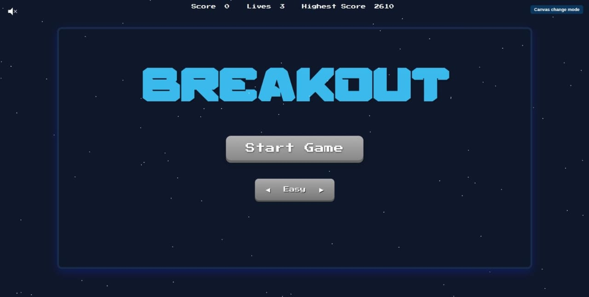
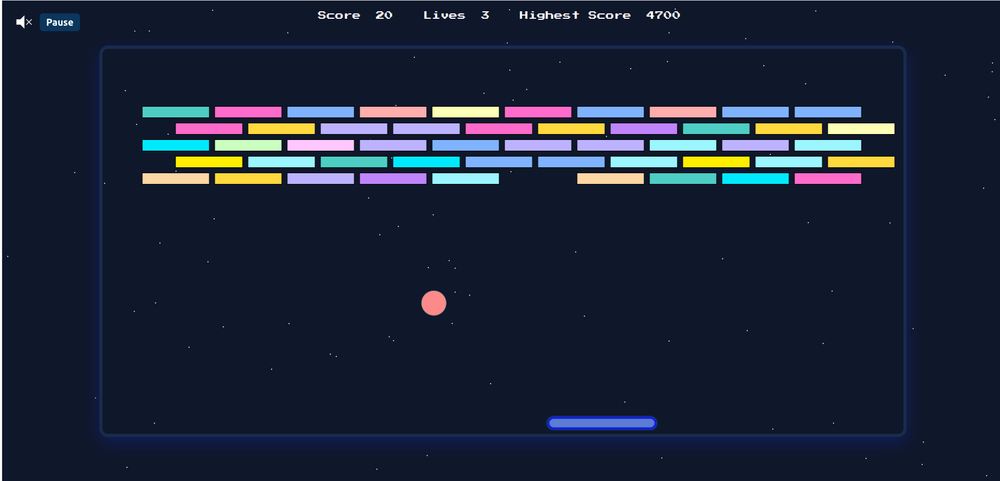

# 🎮 Breakout Game

  


A simple **Breakout clone** built with **HTML, CSS, and Vanilla JavaScript**.  
Move the paddle, bounce the ball, and destroy all the bricks to win!

---

## ✨ Features

- 🕹️ Paddle controlled with keyboard arrows and mouse movement  
- ⚡ Ball physics with wall, paddle, and brick collisions  
- 🧱 Multiple rows of bricks with different shapes  
- 🎁 Power-ups system (`powerups.js`)  
- 🎚️ Adjustable difficulty (`difficulty.js`)  
- 🏆 Game states: start, playing, paused, game over, win  
- 🌌 Change canvas mode to  


---


### Screenshot





---

## 🚀 Getting Started

### Prerequisites
- Any modern browser (Chrome, Firefox, Edge, Safari)  
- Optional: run via a local server (to avoid CORS issues)

### Installation
```bash
git clone https://github.com/TarekSaleh99/breackout-game.git
cd breackout-game
```

### Run
Open `index.html` in your browser.  

Or run with a local server (Node.js example):  
```bash
npx http-server .
```

---

## 📂 Project Structure

```plaintext
breackout-game/
│── index.html        # Main HTML page
│── style.css         # Styles
│── script.js         # Game initialization
│── Paddle.js         # Paddle logic
│── ball.js           # Ball physics & collisions
│── bricks.js         # Brick creation & updates
│── powerups.js       # Power-ups system
│── difficulty.js     # Difficulty settings
│── gameState.js      # Handles game states
│── background.js     # Background and sound rendering
│── Assets/           # Images & sounds
│── Fonts/            # Custom fonts
│── images/           # game images
```

---

## 🎯 Controls

- **⬅️ Arrow Left** → Move paddle left  
- **➡️ Arrow Right** → Move paddle right  
- ** Mouse movement**→ Move paddle  
- Keep the ball from falling and clear all bricks to win!  

---

## 🛠 Customization

You can tweak game settings to suit your style:

- ⚡ Change ball speed or paddle width → `ball.js` and `Paddle.js`  
- 🎚️ Adjust difficulty → `difficulty.js`  
- 🎁 Add new power-ups → `powerups.js`  
- 🌌 Replace background visuals → `background.js`  

---

## 🤝 Contributing

Contributions are welcome! 🎉 

1. Fork the repo  
2. Create a feature branch  
   ```bash
   git checkout -b feature/my-feature 
   ```
3. Commit your changes  
   ```bash
   git commit -m "Add my feature"
   ```
4. Push to your branch  
   ```bash
   git push origin feature/my-feature
   ```
5. Open a Pull Request  

---

## 🙌 Acknowledgments

Inspired by the classic **Atari Breakout** game.  
Special thanks to our supervisor **Mahmoud El-Basha** for guiding us and pushing us to finish this project 🙏
Made for fun and learning 🎮  
